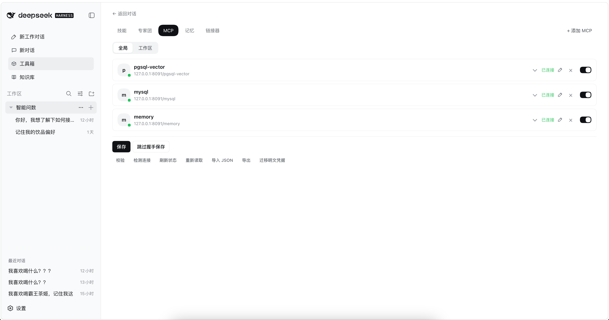
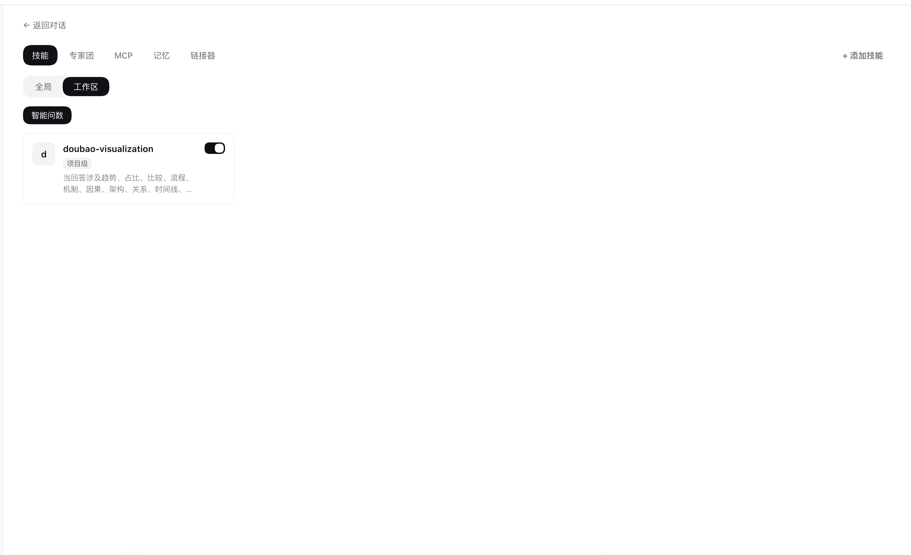
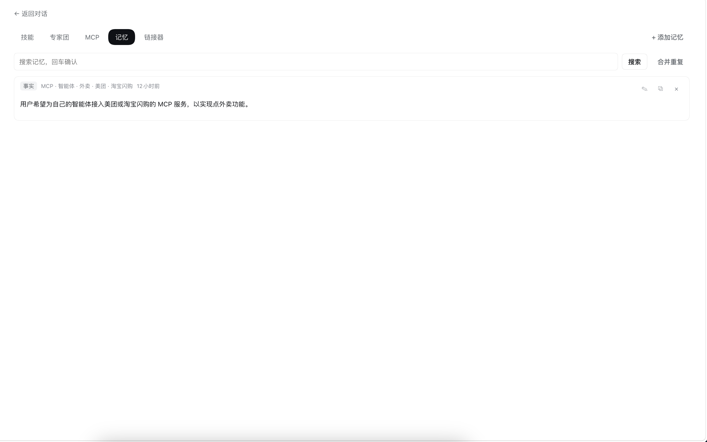

# dsh-sidebar

DeepSeek Harness（DSH）Web 插件：把左侧导航改成**三段式布局**（功能菜单 · 项目对话树 · 最近对话），并在侧边栏提供「工具箱」，直接管理技能、MCP 服务与跨会话记忆。

## 功能特性

- **三段式左侧导航**：功能菜单、项目对话树、快速对话的最近记录；工作区的折叠、高亮、重命名和删除仍由 DSH 自己渲染，底部「设置」不变。
- **工具箱 → MCP**：按「全局 / 工作区」作用域可视化配置 MCP 服务器，保存前真实握手校验，保存后立即生效、无需重启。
- **工具箱 → 记忆**：跨会话记住偏好、约定与项目事实。默认自动提炼入库、按输入召回并注入上下文；Agent 可调用 `memory_search` / `memory_write` / `memory_forget`。
- **工具箱 → 技能**：技能（Skill）管理页，全局 / 项目级切换。

「新对话」始终打开同一个后台项目，项目树里不显示它，会话只出现在「最近对话」。搜索框留在「项目」标题旁（DSH 没有单独的搜索槽）。宿主如果本来就不画出空项目，这里也不会补一行「暂无对话」。

## 截图







## 安装

### 从 GitHub 安装（推荐）

**第 1 步：安装插件**

```sh
dsh plugin --profile web add github:Tomcat099/dsh-sidebar
```

**第 2 步：pnpm ≥ 10 首次会报「构建未授权」错误，按提示授权后重装**

git 安装拉的是源码（不是构建产物），pnpm 默认拒绝运行 `prepare` 构建脚本，所以第一次 `add` 会报 `ERR_PNPM_GIT_DEP_PREPARE_NOT_ALLOWED`。把报错里的包键加入该 profile 的 `pnpm-workspace.yaml`：

```yaml
# 文件：~/.dsh/profiles/web/pnpm-workspace.yaml
allowBuilds:
  dsh-sidebar: true
```

然后**重新执行第 1 步**的 `add` 命令。

> 这等于允许该包代码在安装时于你的机器上执行，只对源码可信的包授权。也可以锁定 commit 安装，避免仓库后续推送悄悄改变实际运行的内容：
> `dsh plugin --profile web add github:Tomcat099/dsh-sidebar#<commit-sha>`

**第 3 步：重启生效**

```sh
dsh web
```

### 本地目录安装（开发调试）

```sh
# macOS
dsh plugin --profile web add file:/path/to/dsh-sidebar
# Windows
dsh plugin --profile web add file:C:/path/to/dsh-sidebar
```

必须带 `file:` 前缀，否则 pnpm 会写成软链。改源码先 `npm run build`，再重启 `dsh web`。

`file:` 安装是硬链复制：改已有文件会同步，但**新增文件不会被 pnpm 搬进 profile**（会报 `Already up to date`）。加了新文件后要清掉 profile 里的旧副本再装一次：

```sh
rm -rf ~/.dsh/profiles/web/node_modules/dsh-sidebar
dsh plugin --profile web add file:/path/to/dsh-sidebar
```

### 验证是否装好

```sh
dsh --profile web --dump-config    # 输出里应能看到 "# == dsh-sidebar" 这一层
```

## 开发

```sh
npm install
npm run build     # tsc → lib/（prepare 自包含，git 安装时也会执行）
npm test          # node --test tests/*.test.js
```

`client/client.js`（浏览器 CJS bundle）与 `lib/`（Host 构建产物）随仓库提交，git 安装即可直接用。

## License

[Apache License 2.0](./LICENSE)
